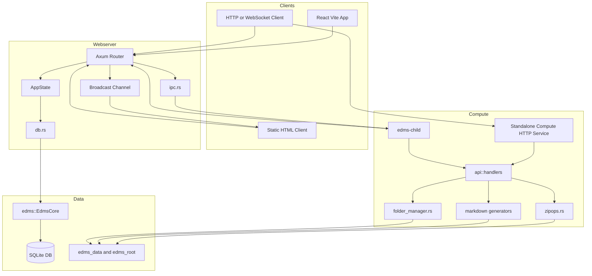
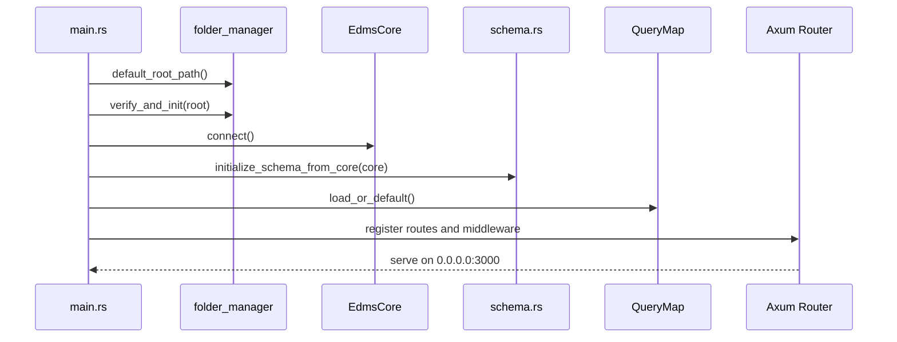
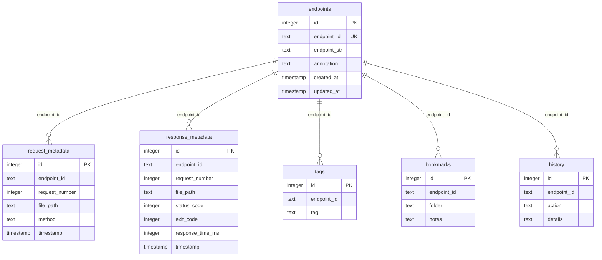
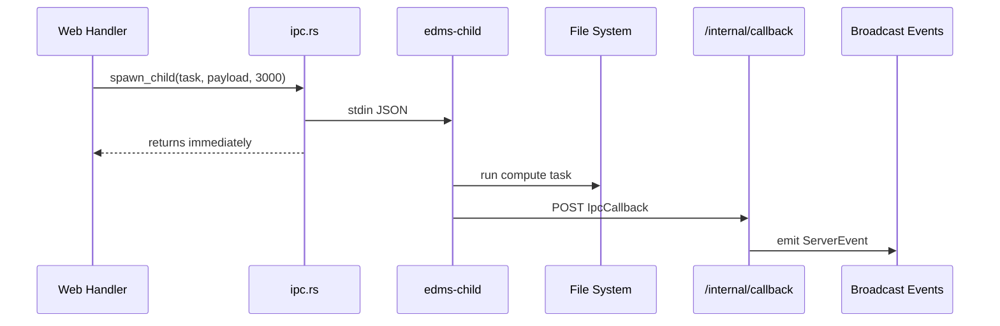
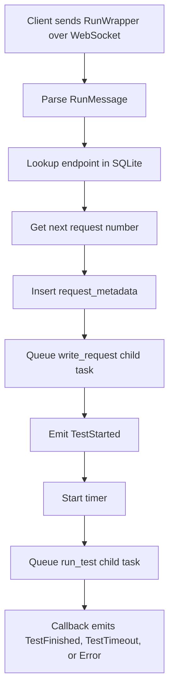
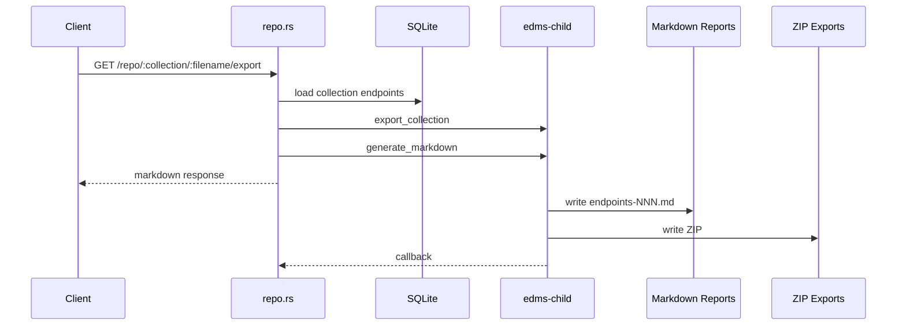

# Architecture

## Purpose

This page describes the actual system layout in the current repository: Axum webserver, SQLite metadata, filesystem artifacts, compute child process, standalone compute service, WebSocket events, root Docker Compose packaging, and the React/static UI split.

For term definitions, see [Definitions](Definitions).

## System Overview

EDMS is a hybrid metadata and artifact system:

| Layer          | Owner                                      | Responsibility                                                                                       |
| -------------- | ------------------------------------------ | ---------------------------------------------------------------------------------------------------- |
| Client         | `frontend`, `backend/webserver/index.html` | Human-facing UI. React uses generated data; static HTML connects to live backend WebSockets.         |
| Webserver      | `backend/webserver`                        | Routes, shared state, SQLite schema setup, metadata operations, event broadcast, IPC child spawning. |
| Shared library | `backend/webserver/libs/edms`              | SQLite wrapper, schema, query map, file IO helpers, validation, domain ops.                          |
| Compute        | `backend/compute`                          | Child-process task execution plus a standalone HTTP service for folders, markdown, ZIP, static export, and file writing. |
| Persistence    | SQLite and local folders                   | Searchable metadata in SQLite; larger artifacts in `edms_data` and `edms_root`.                      |



## Runtime Entry Points

| Entrypoint           | File                                            | Current Role                                                                                              |
| -------------------- | ----------------------------------------------- | --------------------------------------------------------------------------------------------------------- |
| Webserver binary     | `backend/webserver/src/main.rs`                 | Initializes folders, DB, schema, query map, routes, CORS, tracing, and Axum listener on port `3000`.      |
| Compute HTTP service | `backend/compute/src/main.rs`                   | Mounts selected compute handlers as HTTP routes. Uses `COMPUTE_PORT`, defaulting to container port `3000`. |
| Compute child binary | `backend/compute/src/bin/child.rs`              | Reads one JSON IPC request from stdin, runs one task, posts callback to `/internal/callback`, then exits. |
| Shared library       | `backend/webserver/libs/edms/src/lib.rs`        | Re-exports database, schema, query, JSON, and ops modules used by webserver/examples.                     |
| React app            | `frontend/src/main.jsx`, `frontend/src/App.jsx` | Mounts React and routes `/#/`, `/#/testview`, and `/#/list`.                                              |
| Static HTML client   | `backend/webserver/index.html`                  | Browser client that directly connects to backend WebSocket routes on `localhost:3000`.                    |

## Startup Flow

`backend/webserver/src/main.rs` performs this sequence:

1. Resolve `edms_root` through `compute::folder_manager::default_root_path()`, using `EDMS_ROOT_PATH` when set.
2. Create or verify `edms_root` folders with `verify_and_init`.
3. Initialize tracing.
4. Read `EDMS_DB_PATH`, defaulting to `edms.db`.
5. Create `Arc<EdmsCore>` and connect SQLite.
6. Initialize schema through `initialize_schema_from_core`.
7. Load SQL queries through `QueryMap::load_or_default`.
8. Create `AppState`.
9. Register HTTP and WebSocket routes.
10. Add permissive CORS and trace middleware.
11. Bind `0.0.0.0:3000`.



## Data Model

The runtime schema is created in `backend/webserver/libs/edms/src/schema.rs`.

| Table               | Purpose                                                                     |
| ------------------- | --------------------------------------------------------------------------- |
| `endpoints`         | Stable endpoint ID, endpoint string, annotation, timestamps.                |
| `request_metadata`  | Request number, endpoint ID, file path, method, timestamp.                  |
| `response_metadata` | Response file/status/timing metadata paired by endpoint and request number. |
| `metadata`          | Denormalized counts and analytics fields.                                   |
| `tags`              | Unique endpoint tag values.                                                 |
| `bookmarks`         | Endpoint IDs grouped into active, backup, or named collection folders.      |
| `history`           | Endpoint action history with optional details.                              |



Foreign key constraints are not enforced in the connection setup, so relationships are application-level conventions today.

## File and Artifact Layout

| Location                      | Owner                                     | Current Use                                       |
| ----------------------------- | ----------------------------------------- | ------------------------------------------------- |
| `edms_data/{endpoint_id}`     | Webserver/shared file model               | Intended JSON request/response artifacts.         |
| `edms_root/repo`              | Folder manager                            | Repository-ready workspace.                       |
| `edms_root/session-backup`    | Folder manager and active-folder workflow | Source folder area for active-folder transitions. |
| `edms_root/active`            | Folder manager and active-folder workflow | Current active filesystem workspace.              |
| `edms_root/exports`           | Compute ZIP operations                    | ZIP exports and merged archives.                  |
| `edms_root/temp`              | Folder manager                            | Temporary workspace.                              |
| `edms_root/docs`              | Folder manager                            | Documentation artifacts.                          |
| `edms_root/endpoints/reports` | Repo export and markdown generation       | Endpoint markdown reports generated by compute.   |

Local runs normally resolve this layout under `backend/edms_root`. Dockerized runs set `EDMS_ROOT_PATH=/app/edms_root` and mount the shared `edms-root` volume there.

## IPC Architecture

The webserver uses `std::process::Command` in `backend/webserver/src/ipc.rs`.

1. Serialize `IpcRequest { task, payload, callback_port }`.
2. Look for `./target/release/edms-child`, otherwise `./target/debug/edms-child`.
3. Spawn the child with piped stdin.
4. Write one JSON request line.
5. Drop stdin and detach the child process.
6. Receive completion later through `POST /internal/callback`.

The compute child dispatches these task names today:

| Task                 | Handler                    |
| -------------------- | -------------------------- |
| `export_collection`  | `export_collection_inner`  |
| `export_merge`       | `export_merge_inner`       |
| `import_zip`         | `import_zip_inner`         |
| `export_bookmarks`   | `export_bookmarks_inner`   |
| `create_static`      | `create_static_inner`      |
| `export_static`      | `export_static_inner`      |
| `generate_markdown`  | `generate_markdown_inner`  |
| `generate_meta`      | `generate_meta_inner`      |
| `write_endpoint`     | `write_endpoint_inner`     |
| `write_request`      | `write_request_inner`      |
| `write_response`     | `write_response_inner`     |
| `mark_active_folder` | `mark_active_folder_inner` |

Unsupported task names return a failed callback.



## Test Execution Lifecycle

The intended backend endpoint test flow starts on `/test-view/run`.



Important current constraint: `run_test_impl` queues a `run_test` child task, but the production compute child does not dispatch `run_test`. The old webserver child source contains a `run_test` implementation, but the runtime/Docker path uses the compute child.

## Collection Export Lifecycle

`GET /repo/:collection/:filename/export`:

1. Reads endpoint IDs from the `bookmarks` table for the named collection.
2. Batch-loads endpoint DTOs.
3. Queues `export_collection` to create a ZIP.
4. Queues `generate_markdown` to write endpoint report files.
5. Returns a markdown response immediately.
6. Receives child completion through callbacks and emits `ExportReady` events.



## Concurrency Model

| Concern              | Current Mechanism                                                               |
| -------------------- | ------------------------------------------------------------------------------- |
| Web requests         | Axum on Tokio.                                                                  |
| SQLite access        | Shared `Arc<Mutex<Option<Connection>>>` inside `EdmsBase`.                      |
| Blocking DB calls    | Many webserver handlers use `tokio::task::spawn_blocking`.                      |
| Event fanout         | Tokio broadcast channel with capacity `256`.                                    |
| Active folder state  | `Arc<RwLock<Option<String>>>` in `AppState`.                                    |
| Compute work         | Detached OS child process per task.                                             |
| Compute lock manager | Present in `compute/src/lock_manager.rs`, but not wired into runtime workflows. |

## Deployment Model

The coherent container path is:

```bash
docker compose up --build
```

The root compose file defines the full local stack:

| Service     | Dockerfile                         | Host Port | Important Mounts and Environment                                                  |
| ----------- | ---------------------------------- | --------- | --------------------------------------------------------------------------------- |
| `webserver` | `backend/webserver/Dockerfile`     | `3000`    | `backend/webserver/edms.db:/app/edms.db`, `edms-root:/app/edms_root`, `EDMS_DB_PATH`, `EDMS_ROOT_PATH`. |
| `compute`   | `backend/compute/Dockerfile`       | `3001`    | `edms-root:/app/edms_root`, `EDMS_ROOT_PATH`.                                     |
| `frontend`  | `frontend/Dockerfile`              | `5173`    | `./frontend:/app`, `frontend-node-modules:/app/node_modules`.                     |

`backend/webserver/Dockerfile`:

1. Builds `backend/compute` to produce `edms-child`.
2. Builds `backend/webserver` to produce `rust-webserver`.
3. Copies the webserver binary to `/app/rust-webserver`.
4. Copies the child binary to `/app/target/release/edms-child`.
5. Creates runtime folders.
6. Runs `./rust-webserver`.

The standalone compute service exposes direct development routes on host port `3001`, while the webserver keeps using the embedded `edms-child` IPC binary for production workflows.

## Current Constraints

| Constraint                   | Architectural Impact                                                                                                 |
| ---------------------------- | -------------------------------------------------------------------------------------------------------------------- |
| Detached child processes     | The parent has no backpressure, task IDs, or durable task tracking.                                                  |
| Hardcoded callback port      | Child tasks are queued with callback port `3000`.                                                                    |
| `run_test` task mismatch     | The intended WebSocket test workflow cannot complete through the production compute child until dispatch is aligned. |
| Response metadata gap        | Successful run callbacks do not insert `response_metadata`.                                                          |
| Filename convention mismatch | Shared JSON file helpers and compute markdown writers use different request/response artifact names.                 |
| Multi-step DB workflows      | Collection activation uses multiple statements without transaction support.                                          |
| Fixed merge workspace        | Some merge paths can conflict if concurrent merge tasks share the same destination root.                             |
| React integration gap        | React pages do not consume backend routes yet.                                                                       |

## Related Pages

| Page                             | Details                                                    |
| -------------------------------- | ---------------------------------------------------------- |
| [Webserver](Webserver)           | Routes, handlers, state, events, and DB helpers.           |
| [Compute](Compute)               | Child dispatch, ZIP/markdown/folder operations, and tests. |
| [User Interface](User-Interface) | React app and static HTML client.                          |
| [Definitions](Definitions)       | Glossary for terms used here.                              |
