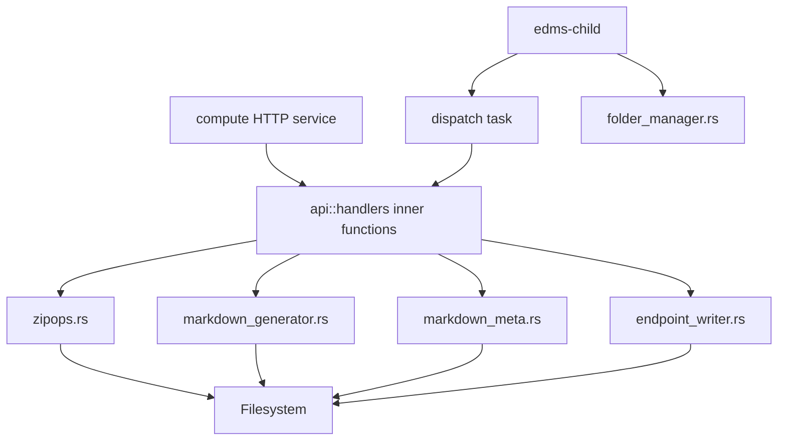

# Compute

## Purpose

`backend/compute` owns EDMS filesystem-heavy work: folder initialization, markdown generation, endpoint document writing, ZIP import/export/merge operations, static export helpers, the production `edms-child` binary used by the webserver IPC layer, and a standalone HTTP service for direct development/testing.

## Crate Surface

| Item               | Path                              | Responsibility                                                                                           |
| ------------------ | --------------------------------- | -------------------------------------------------------------------------------------------------------- |
| Library exports    | `src/lib.rs`                      | Exposes `folder_manager`, `api`, `zipops`, `markdown_generator`, `markdown_meta`, and `endpoint_writer`. |
| HTTP service        | `src/main.rs`                     | Axum server that mounts selected compute handlers for direct HTTP access.                                |
| IPC child          | `src/bin/child.rs`                | Reads one IPC request from stdin, dispatches a task, posts callback to the webserver.                    |
| API handlers       | `src/api/handlers.rs`             | Defines task payload structs plus inner functions used by the child and tests.                           |
| ZIP operations     | `src/zipops.rs`                   | ZIP creation/import/export, bookmark export, static copy/export, folder/ZIP merge, SQLite merge.         |
| Folder manager     | `src/folder_manager.rs`           | Creates and verifies the EDMS root folder layout.                                                        |
| Markdown generator | `src/markdown_generator.rs`       | Generates endpoint table reports split across markdown files.                                            |
| Metadata markdown  | `src/markdown_meta.rs`            | Writes compact endpoint ID metadata lists.                                                               |
| Endpoint writer    | `src/endpoint_writer.rs`          | Writes endpoint/request/response markdown-style files.                                                   |
| Config             | `src/config.rs`, `src/config.yml` | Loads `repo_path` and `per_md_file`; YAML also contains `zip_output`.                                    |
| Lock manager       | `src/lock_manager.rs`             | In-memory reader/writer queue abstraction; not wired into runtime workflows.                             |
| Errors             | `src/errors.rs`                   | Internal and HTTP-facing error types; not consistently used by handlers.                                 |
| Docker image        | `Dockerfile`                      | Builds the standalone `compute` binary and exposes it on container port `3000`.                          |



## Folder Management

`folder_manager.rs` defines the expected `edms_root` layout:

| Folder           | Purpose                                             |
| ---------------- | --------------------------------------------------- |
| `repo`           | Repository-ready workspace.                         |
| `session-backup` | Source/backup folder for active-folder transitions. |
| `active`         | Active filesystem workspace.                        |
| `exports`        | ZIP and merged archive output.                      |
| `temp`           | Temporary workspace.                                |
| `docs`           | Documentation output area.                          |

`verify_and_init(root_path)` is idempotent and returns a `SystemInitReport` describing whether the structure was already healthy, missing folders were created, or the structure was reset.

`default_root_path()` first checks `EDMS_ROOT_PATH`. If that variable is set, compute uses it exactly. Otherwise it walks upward from the current working directory until it finds a parent containing `compute`, then returns `edms_root` under that parent. In normal local backend runs this resolves to `backend/edms_root`; in Docker Compose it is set to `/app/edms_root`.

## Configuration

`src/config.rs` defines:

| Field         | Type     | Meaning                                              |
| ------------- | -------- | ---------------------------------------------------- |
| `repo_path`   | `String` | Output path for markdown/report generation.          |
| `per_md_file` | `usize`  | Number of endpoint rows per generated markdown file. |

`src/config.yml` currently contains:

```yaml
repo_path: "./edms_root/endpoints/reports"
per_md_file: 20
zip_output: "./edms_root/exports"
```

`zip_output` is present in YAML but not in `AppConfig`. Serde YAML ignores unknown fields unless strict unknown-field handling is added.

## Child Process

`src/bin/child.rs` is the production child copied by `backend/webserver/Dockerfile`.

### Protocol Shape

Input over stdin:

```json
{
	"task": "generate_markdown",
	"payload": {},
	"callback_port": 3000
}
```

Output callback:

```json
{
	"task": "generate_markdown",
	"result": {},
	"elapsed_ms": 12,
	"success": true,
	"error": null
}
```

### Dispatch Table

| Task                 | Payload Struct            | Inner Function             |
| -------------------- | ------------------------- | -------------------------- |
| `export_collection`  | `ExportCollectionRequest` | `export_collection_inner`  |
| `export_merge`       | `ExportMergeRequest`      | `export_merge_inner`       |
| `import_zip`         | `ImportZipRequest`        | `import_zip_inner`         |
| `export_bookmarks`   | `BookmarkRequest`         | `export_bookmarks_inner`   |
| `create_static`      | `StaticCreateRequest`     | `create_static_inner`      |
| `export_static`      | `StaticExportRequest`     | `export_static_inner`      |
| `generate_markdown`  | `MarkdownRequest`         | `generate_markdown_inner`  |
| `generate_meta`      | `MetaRequest`             | `generate_meta_inner`      |
| `write_endpoint`     | `EndpointWriteRequest`    | `write_endpoint_inner`     |
| `write_request`      | `RequestDoc`              | `write_request_inner`      |
| `write_response`     | `ResponseDoc`             | `write_response_inner`     |
| `mark_active_folder` | `MarkActiveFolderRequest` | `mark_active_folder_inner` |

Unsupported tasks return `success=false` with an `unknown task` error.

## API Handler Layer

`api/handlers.rs` defines two styles:

| Style                                            | Purpose                                                                                                  |
| ------------------------------------------------ | -------------------------------------------------------------------------------------------------------- |
| `*_inner(payload)` functions                     | Called by `edms-child` and tests.                                                                        |
| Axum handler functions accepting `Json(payload)` | Mounted by the standalone compute HTTP service; the production webserver currently uses IPC child tasks. |

Only some handlers wrap work in `tokio::task::spawn_blocking`; many file operations remain synchronous inside async functions because they usually run inside the child process.

## Standalone HTTP Service

`src/main.rs` starts an Axum server for compute development. It initializes the EDMS root with `folder_manager::verify_and_init`, mounts selected compute handlers, and listens on `COMPUTE_PORT` or `3000` by default.

Local direct run:

```bash
cd backend/compute
EDMS_ROOT_PATH=../edms_root COMPUTE_PORT=3001 cargo run --bin compute
```

Docker Compose maps the service to:

```txt
http://localhost:3001
```

Basic health check:

```bash
curl http://localhost:3001/health
```

## Markdown Generation

### Endpoint Table Reports

`markdown_generator.rs` writes `endpoints-NNN.md` files under a repo/report path.

| Struct/Function                                      | Role                                                                               |
| ---------------------------------------------------- | ---------------------------------------------------------------------------------- |
| `EndpointRecord`                                     | In-memory row for endpoint markdown tables.                                        |
| `create_markdown(repo_path, per_md_file, endpoints)` | Recreates the target output directory and writes endpoint rows split by page size. |
| `create_new_file(repo_path, index)`                  | Creates a markdown table file with header.                                         |

### Metadata List

`markdown_meta.rs` exposes `create_markdown_meta(repo_path, eids)`, which writes `endpoint-data.md` as a simple bullet list of endpoint IDs.

## Endpoint Writer

`endpoint_writer.rs` writes markdown-style content:

| Function                                                   | Filename Pattern                |
| ---------------------------------------------------------- | ------------------------------- |
| `write_endpoint_file(repo_path, eid, page_index, content)` | `{eid}-{page_index:03}.md`      |
| `write_request_file(repo_path, eid, req_index, content)`   | `{eid}-{req_index}-request.md`  |
| `write_response_file(repo_path, eid, res_index, content)`  | `{eid}-{res_index}-response.md` |

The shared webserver library's JSON file helpers use `request-NNN.json` and `response-NNN.json`, so artifact naming needs alignment before request/response archival is fully consistent.

## ZIP and Export Operations

`zipops.rs` provides the largest compute surface.

| Function                    | Behavior                                                                      |
| --------------------------- | ----------------------------------------------------------------------------- |
| `create_zip_from_bookmarks` | Adds files whose filenames start with selected endpoint IDs.                  |
| `import_zip_impl`           | Extracts ZIP contents into a destination folder with path sanitization.       |
| `mark_active_folder`        | Moves a session backup folder into active and writes YAML config.             |
| `zip_collection`            | Zips a collection directory.                                                  |
| `export_merge`              | Combines ZIP entries and folder files into one output ZIP.                    |
| `export_static_website`     | Zips a static folder.                                                         |
| `create_static_website`     | Copies files into a static output folder.                                     |
| `merge_zipfiles`            | Extracts inputs into a workspace, merges SQLite files, and creates final ZIP. |
| `merge_sqlitefiles`         | Finds SQLite files and copies table rows into `merged.sqlite`.                |
| `zip_folder`                | Generic directory-to-ZIP helper.                                              |

ZIP import and extraction strip empty and `..` components and verify output paths remain under the destination directory.

## SQLite Merge

`merge_sqlitefiles`:

1. Creates or opens `workspace/merged.sqlite`.
2. Finds the first `.sqlite` file under each input.
3. Skips the output database itself.
4. Reads source table names.
5. Validates table identifiers.
6. Attaches the source DB as `src`.
7. Creates missing tables with `CREATE TABLE IF NOT EXISTS ... AS SELECT ... WHERE 0`.
8. Inserts rows from source tables.
9. Detaches `src`.

## Lock Manager

`lock_manager.rs` models reader/writer coordination with:

| Field          | Meaning                            |
| -------------- | ---------------------------------- |
| `readonly_set` | Paths currently held for reads.    |
| `write_queue`  | FIFO queue of pending write paths. |
| `active_write` | Current writer path, if any.       |

This manager is not currently called from webserver handlers, ZIP operations, child dispatch, or shared DB code.

## Docker Notes

The repository-root `docker-compose.yml` builds `backend/webserver/Dockerfile` for the main backend and `backend/compute/Dockerfile` for the standalone compute HTTP service.

The webserver Dockerfile still builds `edms-child` in a compute stage and copies it into `/app/target/release/edms-child`, matching the webserver IPC lookup path. The standalone compute service exposes its own routes on host port `3001` for direct development use. Both webserver and compute containers mount the shared `edms-root` volume at `/app/edms_root`.

## Tests

| Test File                    | Coverage                                                                                                         |
| ---------------------------- | ---------------------------------------------------------------------------------------------------------------- |
| `tests/zipops_tests.rs`      | ZIP creation/import/export, bookmark ZIPs, static export, active folder marking, SQLite merge, merge ZIP output. |
| `tests/ipc_child_test.rs`    | Spawns `edms-child`, posts callbacks to a mock Warp server, verifies success and unknown-task failure behavior.  |
| `tests/integration_tests.rs` | Assumes backend is running at `localhost:3000` and checks route/WebSocket reachability.                          |

Commands:

```bash
cd backend/compute
cargo test --test zipops_tests
cargo test --test ipc_child_test
```

With the webserver running:

```bash
cargo test --test integration_tests
```

## Current Constraints

| Constraint                                      | Impact                                                                                                                   |
| ----------------------------------------------- | ------------------------------------------------------------------------------------------------------------------------ |
| No `run_test` dispatch                          | Webserver's live test flow cannot complete through the production compute child.                                         |
| Mixed artifact names                            | JSON helper paths and markdown writer paths disagree.                                                                    |
| Fixed merge workspace                           | Concurrent merge jobs can interfere if they share a destination root.                                                    |
| Partial `spawn_blocking` usage                  | Some synchronous file work runs directly inside async handlers, though production use is usually child-process isolated. |
| Lock manager unused                             | Cross-process file/SQLite coordination is not enforced by the current runtime.                                           |
| `config`, `errors`, `lock_manager` not exported | These modules are useful but not exposed through `lib.rs` today.                                                         |
