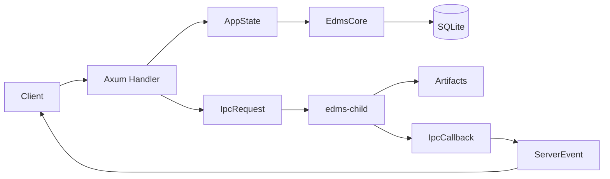

# Definitions

## Purpose

This glossary centralizes terminology used across the EDMS wiki. Other pages should link here instead of repeating definitions.

## EDMS Domain Terms

| Term           | Meaning                                                                                 | Where Used                                           |
| -------------- | --------------------------------------------------------------------------------------- | ---------------------------------------------------- |
| EDMS           | Endpoint Data Management System.                                                        | Repository-wide.                                     |
| Endpoint (E)   | Stable operation identity, usually represented as a path or URL-like string.            | `endpoints`, `EndpointDto`, UI endpoint rows.        |
| Request (Q)    | Payload sent to an endpoint.                                                            | `request_metadata`, request artifacts, JSON editors. |
| Response (P)   | Payload or result received after endpoint processing.                                   | `response_metadata`, response artifacts, callbacks.  |
| EQP            | Endpoint, request, and response relationship described in the README.                   | Product concept.                                     |
| EQP Chaos      | Loss of clarity when endpoint request/response variants change without shared tracking. | Product concept.                                     |
| Annotation     | Human-readable note attached to an endpoint or local test item.                         | `endpoints.annotation`, React state.                 |
| Tag            | Label attached to an endpoint for search/grouping.                                      | `tags` table, `TagOps`, React local tag UI.          |
| Bookmark       | Saved endpoint ID, usually in the active bookmark folder.                               | `bookmarks` table, test/bookmark handlers.           |
| Collection     | Named bookmark folder that can be loaded or exported.                                   | `bookmarks.rs`, `repo.rs`.                           |
| Active folder  | Current in-memory or filesystem workspace.                                              | `AppState.active_folder`, dataview routes.           |
| Session backup | Backup bookmark/folder state before replacing active state.                             | `__session_backup__`, `edms_root/session-backup`.    |
| Artifact       | Generated or stored file such as request JSON, response JSON, markdown, or ZIP.         | `edms_data`, `edms_root`, compute tasks.             |
| Metadata       | Queryable SQLite records describing endpoints or artifacts.                             | Schema and DB helpers.                               |

## Backend Terms

| Term              | Meaning                                                                | Where Used                                  |
| ----------------- | ---------------------------------------------------------------------- | ------------------------------------------- |
| Axum              | Rust web framework used by the backend.                                | `backend/webserver/src/main.rs`.            |
| Handler           | Function mapped to an HTTP or WebSocket route.                         | `backend/webserver/src/handlers`.           |
| WebSocket         | Persistent bidirectional connection for snapshots/events/run messages. | `/test-view/*`, collection/dataview routes. |
| AppState          | Shared backend state passed into handlers.                             | `state.rs`.                                 |
| Broadcast channel | Tokio channel used to fan out server events.                           | `events_tx`.                                |
| ServerEvent       | Serializable event enum sent to WebSocket clients.                     | `events.rs`.                                |
| Callback endpoint | HTTP route where compute children report completion.                   | `/internal/callback`.                       |
| Fire-and-forget   | Starts work and returns without waiting for completion.                | `ipc::spawn_child`.                         |
| Timer             | Tokio task that emits test tick/timeout/cancel events.                 | `timer.rs`.                                 |
| DTO               | Data Transfer Object used between layers.                              | `EndpointDto`, `HistoryEntry`.              |

## Compute and IPC Terms

| Term           | Meaning                                                          | Where Used                                          |
| -------------- | ---------------------------------------------------------------- | --------------------------------------------------- |
| IPC            | Inter-process communication between webserver and compute child. | `ipc.rs`, `compute/src/bin/child.rs`.               |
| Parent process | Webserver process that spawns child work.                        | `ipc::spawn_child`.                                 |
| Child process  | `edms-child`, which receives one task and exits after callback.  | `compute/src/bin/child.rs`.                         |
| IpcRequest     | JSON task envelope sent to child stdin.                          | `task`, `payload`, `callback_port`.                 |
| IpcCallback    | JSON result posted by child to webserver.                        | `task`, `result`, `elapsed_ms`, `success`, `error`. |
| Task name      | String dispatch key such as `export_merge` or `write_request`.   | Child dispatch table.                               |
| Payload        | Task-specific JSON body inside an IPC request.                   | Compute handler structs.                            |
| Correlation ID | ID that links a callback to a specific request.                  | Not implemented today.                              |
| ZIP import     | Extracting a ZIP into a sanitized destination folder.            | `zipops::import_zip_impl`.                          |
| ZIP merge      | Combining ZIP and folder inputs into one archive.                | `zipops::export_merge`, `merge_zipfiles`.           |
| Static export  | Copying or zipping a static folder.                              | `create_static_website`, `export_static_website`.   |

## Rust Terms

| Term                | Meaning                                                         | Where Used                                         |
| ------------------- | --------------------------------------------------------------- | -------------------------------------------------- |
| Ownership           | Rust rule that each value has an owner responsible for cleanup. | Path buffers, payloads, state clones.              |
| Borrowing           | Temporary reference access without taking ownership.            | `&EdmsCore`, `&Path`, `&str`.                      |
| Trait               | Shared behavior contract implemented by types.                  | `AsRef<Path>`, `IntoResponse`, `DeserializeOwned`. |
| `Result<T, E>`      | Success-or-error return type.                                   | Most Rust modules.                                 |
| `Arc`               | Atomically reference-counted shared ownership pointer.          | `AppState`, `EdmsBase`, lock manager.              |
| `Mutex`             | Mutual exclusion lock.                                          | SQLite connection, compute lock manager.           |
| `RwLock`            | Read/write lock allowing many readers or one writer.            | `AppState.active_folder`.                          |
| `spawn_blocking`    | Tokio helper for blocking work.                                 | DB calls and some compute handlers.                |
| `tokio::spawn`      | Starts an async task.                                           | WebSocket run tasks and timers.                    |
| `CancellationToken` | Cooperative cancellation primitive.                             | `timer.rs`.                                        |
| Serde               | Serialization/deserialization framework.                        | JSON/YAML, IPC, events.                            |

## Database Terms

| Term               | Meaning                                                | Where Used                                                   |
| ------------------ | ------------------------------------------------------ | ------------------------------------------------------------ |
| SQLite             | Embedded relational database stored in a local file.   | `edms.db`, `rusqlite`.                                       |
| Schema             | Tables and indexes defining stored data.               | `schema.rs`.                                                 |
| Index              | Database structure for faster lookup.                  | Endpoint, request, response, tag, bookmark, history indexes. |
| Query map          | YAML-backed collection of SQL statements.              | `queries.yaml`, `QueryMap`.                                  |
| Prepared statement | Compiled SQL statement with bound parameters.          | `rusqlite`, `EdmsCore::cproc`.                               |
| Query parameter    | Value bound to a `?` placeholder.                      | DB helper functions.                                         |
| Transaction        | Group of statements that commit or roll back together. | Needed for future multi-step bookmark workflows.             |
| PRAGMA             | SQLite configuration or inspection command.            | Foreign key and integrity behavior.                          |
| Integrity check    | SQLite consistency validation.                         | `sqlite_utils`.                                              |

## Frontend Terms

| Term                  | Meaning                                                                 | Where Used                                   |
| --------------------- | ----------------------------------------------------------------------- | -------------------------------------------- |
| React hook            | Function such as `useState` or `useEffect` for component state/effects. | React pages and custom hooks.                |
| Virtual DOM           | React's in-memory UI representation.                                    | React render lifecycle.                      |
| Component composition | Building screens from smaller reusable components.                      | Home, List View, Test View.                  |
| Prop flow             | Parent components passing values/callbacks to children.                 | Page components to tables/sidebar/editors.   |
| Controlled input      | Input whose value is owned by React state.                              | Search, URL, JSON editor, annotations, tags. |
| Hash routing          | Client routing with URL fragments.                                      | `HashRouter`, routes like `/#/list`.         |
| Tailwind CSS          | Utility-first styling framework.                                        | `index.css`, component class names.          |
| Dummy data            | Generated local endpoint data used by the current React UI.             | `generateDummyEndpoints`.                    |

## Operations and Testing Terms

| Term                 | Meaning                                                        | Where Used                                    |
| -------------------- | -------------------------------------------------------------- | --------------------------------------------- |
| Docker compose       | Multi-container/local orchestration command.                   | `docker-compose.yml`.                         |
| Multi-stage build    | Docker build with separate compile/runtime stages.             | `backend/webserver/Dockerfile`.               |
| Docker service       | One named container unit in the compose stack.                 | `webserver`, `compute`, `frontend`.           |
| Volume               | Persistent Docker storage.                                     | `webserver-data`, `edms-root`, `frontend-node-modules`, DB bind mount. |
| Environment variable | Runtime configuration passed through process environment.      | `EDMS_DB_PATH`, `EDMS_ROOT_PATH`, `RUST_LOG`. |
| Unit test            | Test focused on one module/function area.                      | `zipops_tests.rs`.                            |
| IPC child test       | Test that spawns `edms-child` and verifies callback behavior.  | `ipc_child_test.rs`.                          |
| Integration test     | Test that expects multiple running pieces.                     | `integration_tests.rs`.                       |
| Mock server          | Test server standing in for a dependency.                      | Warp callback server.                         |
| Fixture              | Prepared test input such as temp dirs/files/DBs.               | Compute tests.                                |
| Smoke test           | Quick route or command check that confirms basic availability. | `curl /home`, `curl /dataview/dashboard`.     |

## Quick Reference

