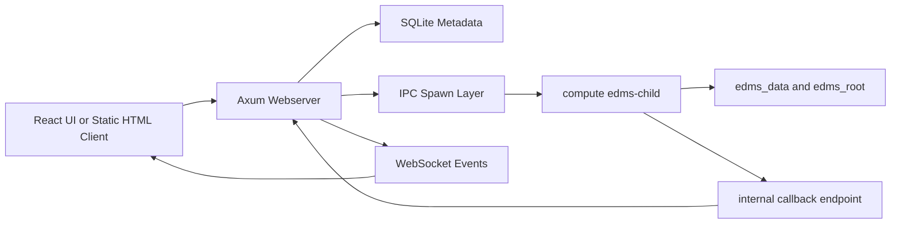

# EDMS Wiki Home

## Purpose

EDMS is the Endpoint Data Management System in this repository. It is a local-first Rust and React project for cataloging endpoints, storing request/response metadata, organizing endpoint collections, and generating portable documentation/export artifacts.

The current repository has four main surfaces:

| Area                | Path                          | What It Does Today                                                                                                                                             |
| ------------------- | ----------------------------- | -------------------------------------------------------------------------------------------------------------------------------------------------------------- |
| Webserver           | `backend/webserver`           | Runs the Axum backend on port `3000`, initializes SQLite schema, exposes HTTP/WebSocket routes, stores metadata, emits events, and spawns compute child tasks. |
| Compute             | `backend/compute`             | Provides filesystem, ZIP, markdown, folder initialization, IPC child task handlers through `edms-child`, and a standalone compute HTTP service for development. |
| Shared EDMS library | `backend/webserver/libs/edms` | Wraps SQLite access, schema creation, query loading, JSON utilities, and typed endpoint/request/response/tag operations.                                       |
| Frontend            | `frontend`                    | Vite React UI with Home, Test View, and List View routes. The React UI currently uses local/generated data rather than live backend API calls.                 |



## Repository Map

```txt
.
|-- README.md
|-- CONTRIBUTORS.md
|-- docker-compose.yml
|-- backend
|   |-- .dockerignore
|   |-- compute
|   |   |-- Cargo.toml
|   |   |-- Dockerfile
|   |   |-- src
|   |   |   |-- api/handlers.rs
|   |   |   |-- main.rs
|   |   |   |-- bin/child.rs
|   |   |   |-- folder_manager.rs
|   |   |   |-- markdown_generator.rs
|   |   |   |-- endpoint_writer.rs
|   |   |   `-- zipops.rs
|   |   `-- tests
|   `-- webserver
|       |-- Cargo.toml
|       |-- Dockerfile
|       |-- index.html
|       |-- seed_data.sql
|       |-- src
|       |   |-- main.rs
|       |   |-- db.rs
|       |   |-- ipc.rs
|       |   |-- state.rs
|       |   |-- timer.rs
|       |   `-- handlers
|       `-- libs/edms
|           `-- src
|-- frontend
|   |-- Dockerfile
|   |-- package.json
|   `-- src
```

## Local Setup

### Prerequisites

Install these locally before running the project:

| Tool                      | Purpose                                                                                                                      |
| ------------------------- | ---------------------------------------------------------------------------------------------------------------------------- |
| Rust/Cargo                | Builds `rust-webserver`, `edms-child`, tests, and the shared library examples. Rust `1.88` or newer matches the Dockerfiles. |
| Node.js and npm           | Installs and runs the Vite React frontend.                                                                                   |
| SQLite CLI                | Optional, only needed for loading `seed_data.sql` manually.                                                                  |
| Docker and Docker Compose | Optional, only needed for the Dockerized full-stack setup.                                                                   |

Quick checks:

```bash
cargo --version
node --version
npm --version
docker --version
```

Unless noted otherwise, setup commands below assume you are starting from the repository root.

### Local Backend Setup

The webserver spawns `edms-child` from its own working directory at `./target/release/edms-child` or `./target/debug/edms-child`. For local development, build the compute child and copy it into the webserver target directory before running the webserver.

```bash
cd backend/compute
cargo build --bin edms-child
mkdir -p ../webserver/target/debug
cp target/debug/edms-child ../webserver/target/debug/edms-child
```

Run the webserver:

```bash
cd backend/webserver
EDMS_DB_PATH=edms.db EDMS_ROOT_PATH=../edms_root cargo run --bin rust-webserver
```

The backend listens on:

```txt
http://localhost:3000
```

Smoke-test it from another terminal:

```bash
curl http://localhost:3000/home
curl http://localhost:3000/dataview/dashboard
```

### Local Standalone Compute Service

The webserver does not call this service in the main runtime path; it still spawns `edms-child` through IPC. The standalone compute service is useful when developing or testing compute handlers directly.

Run it in a separate terminal:

```bash
cd backend/compute
EDMS_ROOT_PATH=../edms_root COMPUTE_PORT=3001 cargo run --bin compute
```

Smoke-test it from another terminal:

```bash
curl http://localhost:3001/health
```

### Optional Seed Data

To load the tracked SQL seed file into the local backend database:

```bash
cd backend/webserver
sqlite3 edms.db < seed_data.sql
```

Then restart the backend if it was already running.

### Frontend Setup

The React app is independent from the backend runtime right now. It starts a Vite dev server and renders generated/local data.

```bash
cd frontend
npm install
npm run dev
```

Open the Vite URL printed by the command, usually:

```txt
http://localhost:5173
```

Frontend routes use hash routing:

| Route         | Page      |
| ------------- | --------- |
| `/#/`         | Home      |
| `/#/testview` | Test View |
| `/#/list`     | List View |

### Static Backend Client

`backend/webserver/index.html` is a standalone HTML client that connects directly to the backend WebSocket routes at `localhost:3000`. It is separate from the Vite React app and is useful when manually testing the live WebSocket API.

### Dockerized Setup

The supported compose path is the repository-root `docker-compose.yml`. It starts the webserver, standalone compute service, and Vite frontend together from one command.

The compose stack includes:

| Service     | Build Context        | Host Port | Runtime Notes                                                                                 |
| ----------- | -------------------- | --------- | --------------------------------------------------------------------------------------------- |
| `webserver` | `./backend`          | `3000`    | Builds `rust-webserver` plus `edms-child`; uses `EDMS_DB_PATH=/app/edms.db`.                  |
| `compute`   | `./backend/compute`  | `3001`    | Runs the standalone compute HTTP service on container port `3000`.                            |
| `frontend`  | `./frontend`         | `5173`    | Runs the Vite dev server with the frontend source bind-mounted for live edits.                |

The webserver and compute containers share the `edms-root` volume at `/app/edms_root` through `EDMS_ROOT_PATH=/app/edms_root`. The frontend uses a separate `frontend-node-modules` volume so the container's installed packages do not overwrite the host workspace.

Create the bind-mounted DB file if it does not already exist:

```bash
touch backend/webserver/edms.db
docker compose up --build
```

Docker exposes the app at:

```txt
Backend:  http://localhost:3000
Compute:  http://localhost:3001
Frontend: http://localhost:5173
```

Useful compose commands:

```bash
docker compose up --build
docker compose up --build -d
docker compose logs -f webserver
docker compose down
```

## Common Commands

### Backend Commands

```bash
cd backend/webserver
EDMS_DB_PATH=edms.db EDMS_ROOT_PATH=../edms_root cargo run --bin rust-webserver
cargo test
```

### Compute Commands

```bash
cd backend/compute
cargo build --bin edms-child
EDMS_ROOT_PATH=../edms_root COMPUTE_PORT=3001 cargo run --bin compute
cargo test --test zipops_tests
cargo test --test ipc_child_test
```

The live integration tests require a backend already running on `localhost:3000`:

```bash
cd backend/compute
cargo test --test integration_tests
```

### Shared Library Examples

```bash
cd backend/webserver/libs/edms
cargo run --example basic_usage
cargo run --example analytics
cargo run --example json_validation
```

### Frontend Commands

```bash
cd frontend
npm run dev
npm run lint
npm run build
npm run preview
```

### Dockerized Commands

```bash
docker compose config
docker compose up --build
docker compose logs -f
docker compose down
```

## Runtime Behavior

| Workflow                  | Current Status                                                                                                       |
| ------------------------- | -------------------------------------------------------------------------------------------------------------------- |
| Backend startup           | Initializes `edms_root`, opens SQLite, creates schema, loads SQL query map, and binds `0.0.0.0:3000`.                |
| Standalone compute        | Exposes selected compute handlers over HTTP for direct development on host port `3001` in Docker or local runs.      |
| Endpoint metadata         | Stored in SQLite through the shared `edms` library and webserver `db.rs` helpers.                                    |
| Request metadata          | Inserted during `/test-view/run` WebSocket flow before compute work is queued.                                       |
| Response metadata         | Schema/helper exists, but callback handling currently emits `TestFinished` without inserting response metadata.      |
| Bookmarks and collections | Stored in the `bookmarks` table using `__active__`, `__session_backup__`, and named folders.                         |
| Export workflows          | Webserver queues compute child tasks for collection ZIPs, markdown generation, merges, and active-folder sync.       |
| React UI                  | Provides dashboard/list/test screens with local state and generated data. Live backend integration is not wired yet. |
| Static HTML UI            | Connects directly to backend WebSockets and is closer to the live backend contract.                                  |

## Wiki Navigation

| Page                              | Purpose                                                                               |
| --------------------------------- | ------------------------------------------------------------------------------------- |
| [What Is EDMS?](What-is-EDMS-%3F) | Product problem, conceptual model, and project value.                                 |
| [Architecture](Architecture)      | System layout, data flow, lifecycle, persistence, deployment, and constraints.        |
| [Webserver](Webserver)            | Axum routes, state, database facade, events, IPC parent layer, and backend handlers.  |
| [Compute](Compute)                | Compute modules, child dispatch, ZIP/markdown/folder operations, and tests.           |
| [User Interface](User-Interface)  | React routes/components, static HTML client, styling, and integration status.         |
| [Definitions](Definitions)        | Shared glossary for EDMS domain, Rust, database, frontend, IPC, and operations terms. |

## Development Workflow

| Task                     | Start Here                                                                | Notes                                                                                                   |
| ------------------------ | ------------------------------------------------------------------------- | ------------------------------------------------------------------------------------------------------- |
| Add a backend route      | `backend/webserver/src/main.rs`, `backend/webserver/src/handlers`         | Register the route in `main.rs` and use `State<AppState>` for shared resources.                         |
| Add a compute child task | `backend/compute/src/api/handlers.rs`, `backend/compute/src/bin/child.rs` | Add the typed payload/inner handler and add the task name to child dispatch.                            |
| Add a SQL query          | `backend/webserver/libs/edms/src/queries.yaml`                            | Keep query column order aligned with callers that use positional row indexes.                           |
| Add schema fields        | `backend/webserver/libs/edms/src/schema.rs`                               | Update shared ops, webserver helpers, seed data, and docs together.                                     |
| Wire React to backend    | `frontend/src/components/pages`, new API utilities                        | Current pages use local state, so add a fetch/WebSocket adapter before replacing component data shapes. |
| Add tests                | `backend/compute/tests`, shared library examples, future frontend tests   | Compute has the strongest tracked tests today; webserver/frontend automated coverage is limited.        |

## Current Implementation Constraints

These are documented so contributors know what is real today:

| Constraint                 | Impact                                                                                                                                                                                                                                        |
| -------------------------- | --------------------------------------------------------------------------------------------------------------------------------------------------------------------------------------------------------------------------------------------- |
| `run_test` task mismatch   | The webserver queues `run_test`, but the production compute child does not dispatch it. The legacy `backend/webserver/src/bin/child.rs` has a `run_test` implementation, but the Docker/runtime path uses `backend/compute/src/bin/child.rs`. |
| Child binary location      | Local webserver runs need `edms-child` copied into `backend/webserver/target/debug` or `target/release`. Docker already handles this.                                                                                                         |
| Response metadata gap      | The callback handler writes/announces response artifacts but does not insert `response_metadata`.                                                                                                                                             |
| Artifact filename mismatch | Shared `file_io.rs` uses `request-NNN.json` and `response-NNN.json`; compute `endpoint_writer.rs` writes markdown-style names.                                                                                                                |
| Frontend backend gap       | The React app simulates data and does not call the Axum routes yet.                                                                                                                                                                           |
| Webserver config gap       | `backend/webserver/src/config.rs` and `config.yaml` exist, but `main.rs` currently hardcodes `0.0.0.0:3000`.                                                                                                                                  |

## Contribution Checklist

1. Keep behavior changes close to the owning module.
2. Preserve JSON compatibility between `webserver/src/ipc.rs` and `compute/src/bin/child.rs`.
3. Update this wiki when route behavior, setup steps, or task names change.
4. Add tests beside the behavior being changed.
5. Re-run the relevant command group from [Common Commands](#common-commands).
