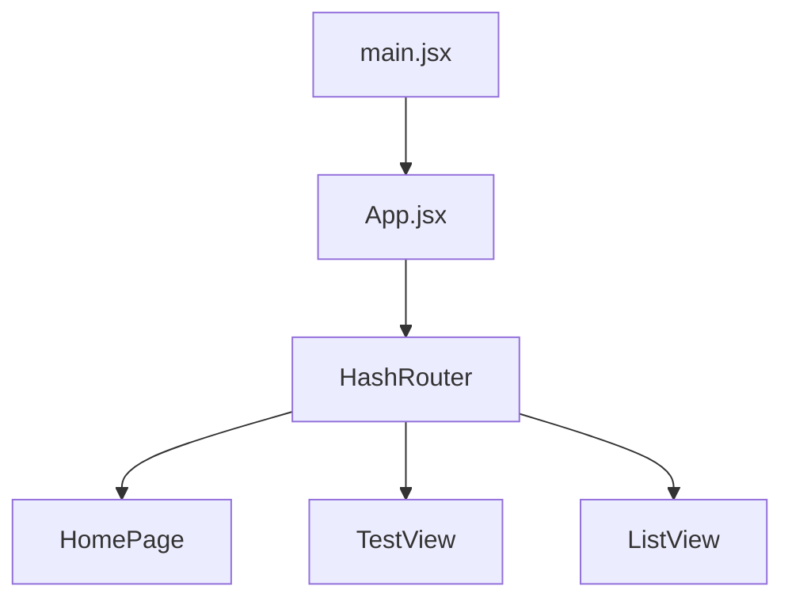
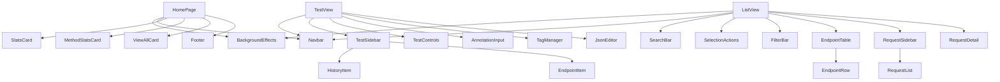

# User Interface

## Purpose

EDMS has two UI surfaces in the repository:

| Surface               | Path                           | Current Status                                                                                 |
| --------------------- | ------------------------------ | ---------------------------------------------------------------------------------------------- |
| React app             | `frontend`                     | Vite React app with Home, Test View, and List View. It uses local/generated state today.       |
| Static backend client | `backend/webserver/index.html` | Standalone HTML page that opens live WebSocket connections to the backend on `localhost:3000`. |

## React Application

### Stack

| Tool           | Use                                                                            |
| -------------- | ------------------------------------------------------------------------------ |
| React 19       | Component rendering and local state.                                           |
| React Router 7 | Hash-based routing.                                                            |
| Vite 7         | Dev server and production build.                                               |
| Tailwind CSS 3 | Utility styling and custom component classes.                                  |
| React Icons    | Icon package dependency, though several current buttons use text/emoji glyphs. |

### Running the React App

Local development:

```bash
cd frontend
npm install
npm run dev
```

Dockerized development from the repository root:

```bash
docker compose up --build frontend
```

Both paths expose the Vite app at:

```txt
http://localhost:5173
```

### Routes

`frontend/src/App.jsx` declares:

| Hash Route    | Component  |
| ------------- | ---------- |
| `/#/`         | `HomePage` |
| `/#/testview` | `TestView` |
| `/#/list`     | `ListView` |



## Component Structure

| Area                 | Path                      | Responsibility                                                                                |
| -------------------- | ------------------------- | --------------------------------------------------------------------------------------------- |
| Pages                | `src/components/pages`    | Page-level state and workflow orchestration.                                                  |
| Layout               | `src/components/layout`   | Navbar, footer, and background effects.                                                       |
| Common controls      | `src/components/common`   | Search, filters, selection actions, method badge, JSON editor, annotation input, tag manager. |
| Home components      | `src/components/home`     | Stats cards, method stats, view-all card.                                                     |
| List view components | `src/components/listview` | Endpoint table, rows, request sidebar, request list, request detail.                          |
| Test view components | `src/components/testview` | Sidebar, history/endpoint items, controls, request/response panels.                           |
| Hooks                | `src/hooks`               | Mouse position and scroll detection helpers.                                                  |
| Utilities            | `src/utils`               | Dummy data generation, byte formatting, method color mapping.                                 |



## Data Flow Status

The React app does not currently call the Rust backend.

| Page       | Current Data Source                                                                     | Persistence             |
| ---------- | --------------------------------------------------------------------------------------- | ----------------------- |
| `HomePage` | Hardcoded stats: `78` endpoints, `23` bookmarks, default method stats.                  | None.                   |
| `TestView` | Local React state, generated endpoint list, simulated echo response after `setTimeout`. | In memory until reload. |
| `ListView` | `generateDummyEndpoints(20)` after a simulated delay.                                   | In memory until reload. |

## Home Page

`HomePage.jsx` renders a dashboard-style entry screen with:

| Component           | Behavior                                                            |
| ------------------- | ------------------------------------------------------------------- |
| `StatsCard`         | Displays total endpoints and total bookmarks from hardcoded values. |
| `MethodStatsCard`   | Displays method distribution from defaults or supplied stats.       |
| `ViewAllCard`       | Links to `/#/list`.                                                 |
| `BackgroundEffects` | Uses mouse position to move a radial gradient effect.               |

It does not call `/dataview/dashboard`.

## List View

`ListView.jsx` is the browsing workflow. It loads generated endpoints, supports table selection, search, tag expansion, request selection, and request/response detail display.

### State Areas

| State                                            | Purpose                                                             |
| ------------------------------------------------ | ------------------------------------------------------------------- |
| `endpoints`, `loading`                           | Generated data and loading state.                                   |
| `selectedEndpoints`                              | Checked endpoint rows.                                              |
| `selectedEndpoint`                               | Current endpoint whose requests are shown.                          |
| `selectedRequestNum`, `selectedRequests`         | Request detail and request checkbox selection.                      |
| `searchQuery`, `searchFilter`, `isSearchApplied` | Client-side search behavior.                                        |
| `filterType`                                     | Current filter bar selection; not currently used to transform rows. |
| `folderName`                                     | Text input state in the top bar.                                    |
| `expandedTags`                                   | Per-endpoint tag expansion state.                                   |

### Search Behavior

Search runs only after apply/Enter. Supported search filters:

| Filter       | Matches                                        |
| ------------ | ---------------------------------------------- |
| `all`        | Method, URL, tags, annotation, date, and time. |
| `method`     | HTTP method.                                   |
| `tags`       | Tag values.                                    |
| `annotation` | Annotation text.                               |
| `date`       | Date or time strings.                          |
| `url`        | Endpoint URL.                                  |

### List View Components

| Component          | Responsibility                                         |
| ------------------ | ------------------------------------------------------ |
| `SearchBar`        | Controlled query/filter input and apply/clear actions. |
| `FilterBar`        | Filter buttons that update `filterType`.               |
| `SelectionActions` | Bulk action bar shown when endpoints are selected.     |
| `EndpointTable`    | Sticky table header and endpoint row mapping.          |
| `EndpointRow`      | Method badge, URL, tags, sizes, annotation, date/time. |
| `RequestSidebar`   | Request list for the selected endpoint.                |
| `RequestList`      | Request checkboxes and request selection.              |
| `RequestDetail`    | Shows selected request and response JSON-like data.    |

## Test View

`TestView.jsx` is an interactive request builder with local history/bookmark state.

### Current Execution

`handleTest()`:

1. Requires a URL.
2. Sets loading state.
3. Waits `500ms`.
4. Parses request JSON when present.
5. Creates an echo response with method, URL, request data, and timestamp.
6. Prepends a history item.
7. Clears tags and annotation.
8. Displays parse errors as response text.

This is a simulation and does not call `/test-view/run`.

### Test View Components

| Component         | Behavior                                                                                                |
| ----------------- | ------------------------------------------------------------------------------------------------------- |
| `TestSidebar`     | Switches between history, bookmarks, and generated endpoints; includes filters and load timing display. |
| `EndpointItem`    | Displays generated endpoint path, method, status/category, response time, and description.              |
| `HistoryItem`     | Displays local history/bookmark items.                                                                  |
| `TestControls`    | Renders Test, Stop, Save, Download, and URL-copy controls; Test is wired through props.                 |
| `AnnotationInput` | Tracks annotation text and word count.                                                                  |
| `TagManager`      | Adds/removes local tags and enforces max tag count.                                                     |
| `JsonEditor`      | Textarea for request and read-only response display with byte count/actions.                            |

## Hooks and Utilities

| Item                            | Behavior                                                                                                    |
| ------------------------------- | ----------------------------------------------------------------------------------------------------------- |
| `useMousePosition`              | Tracks `mousemove` and returns `{ x, y }`.                                                                  |
| `useScrollDetection`            | Tracks whether `window.scrollY` is greater than a threshold; currently available but not wired into Navbar. |
| `getMethodColor(method)`        | Maps HTTP methods to UI color classes.                                                                      |
| `formatBytes(bytes)`            | Formats byte counts as B, KB, MB, or GB.                                                                    |
| `generateDummyEndpoints(count)` | Creates endpoint rows with method, URL, tags, annotation, date/time, requests, and responses.               |

## Styling

| File                 | Role                                                                                               |
| -------------------- | -------------------------------------------------------------------------------------------------- |
| `tailwind.config.js` | Scans `index.html` and `src/**/*.{js,jsx,ts,tsx}`.                                                 |
| `postcss.config.js`  | Enables Tailwind and Autoprefixer.                                                                 |
| `src/index.css`      | Tailwind directives, custom components, animations, scrollbars, and method badge styles.           |
| `src/App.css`        | Extra CSS exists but is not imported by `App.jsx`; `index.css` is the active app-level stylesheet. |

The current design uses HashedTokens branding, light surfaces, green/beige accents, rounded panels, gradient buttons, and custom scrollbars.

## Static Backend Client

`backend/webserver/index.html` is separate from the React build. It defines:

```js
const API_BASE = "http://localhost:3000";
const WS_BASE = "ws://localhost:3000";
```

It opens WebSockets for:

| WebSocket                   | Purpose                                |
| --------------------------- | -------------------------------------- |
| `/test-view/endpoints/load` | Endpoint snapshots and events.         |
| `/test-view/bookmarks/load` | Bookmark snapshots and events.         |
| `/test-view/run`            | Run messages and backend event frames. |

The static page maintains browser-side arrays for endpoints, bookmarks, history, events, and running tests. It is useful for backend contract testing because it points at the live Axum routes.

## Backend Integration Status

| Capability            | React App Today               | Backend Capability                                                           |
| --------------------- | ----------------------------- | ---------------------------------------------------------------------------- |
| Dashboard counts      | Hardcoded values.             | `/dataview/dashboard`.                                                       |
| Load endpoints        | `generateDummyEndpoints(20)`. | `/test-view/endpoints/load` WebSocket.                                       |
| Load bookmarks        | Local bookmark state.         | `/test-view/bookmarks/load` WebSocket.                                       |
| Run endpoint test     | Simulated echo response.      | `/test-view/run` route exists, but `run_test` child dispatch is not aligned. |
| Save history/bookmark | Local state only.             | POST routes exist.                                                           |
| Export selected data  | Console log placeholders.     | `/repo/:collection/:filename/export`.                                        |

## Recommended Integration Path

1. Add a small API layer, for example `src/api/http.js` and `src/api/ws.js`.
2. Keep dummy data as a development fallback.
3. Normalize backend `EndpointDto` into the richer table row shape, or simplify table components to accept backend shape.
4. Reuse backend `ServerEvent` names through frontend constants.
5. Add frontend tests around search/filter behavior before replacing the data source.
6. Wire Test View only after the backend `run_test` task path is reconciled.
