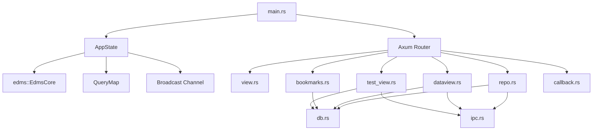

# Webserver

## Purpose

`backend/webserver` is the EDMS coordination layer. It runs the Axum server, initializes SQLite, exposes HTTP and WebSocket routes, stores endpoint metadata, emits server events, and spawns `edms-child` for compute-heavy filesystem work.

## Crate Composition

| Module         | Path              | Responsibility                                                                                             |
| -------------- | ----------------- | ---------------------------------------------------------------------------------------------------------- |
| Entrypoint     | `src/main.rs`     | Startup, folder initialization, schema initialization, route registration, CORS, tracing, and server bind. |
| State          | `src/state.rs`    | Shared `AppState` containing database core, query map, event sender, and active folder lock.               |
| DB facade      | `src/db.rs`       | Webserver-specific endpoint, request, response, bookmark, collection, and history helpers.                 |
| IPC            | `src/ipc.rs`      | Parent-side child process spawning and IPC JSON protocol types.                                            |
| Events         | `src/events.rs`   | `ServerEvent` enum sent through broadcast/WebSocket flows.                                                 |
| Timer          | `src/timer.rs`    | Emits test timer ticks, timeout, and cancellation events.                                                  |
| Handlers       | `src/handlers/*`  | Route-specific behavior.                                                                                   |
| Shared library | `libs/edms/src/*` | SQLite wrapper, schema, query loader, typed ops, JSON/file utilities.                                      |



## Startup Flow

`src/main.rs` starts the backend with these runtime choices:

| Step          | Behavior                                                                                                    |
| ------------- | ----------------------------------------------------------------------------------------------------------- |
| Folder root   | Uses `compute::folder_manager::default_root_path()`.                                                        |
| Folder setup  | Calls `verify_and_init` to create/verify `repo`, `session-backup`, `active`, `exports`, `temp`, and `docs`. |
| Database path | Reads `EDMS_DB_PATH`, defaulting to `edms.db`.                                                              |
| Schema        | Calls `initialize_schema_from_core`.                                                                        |
| SQL queries   | Loads `QueryMap::load_or_default`, using embedded YAML fallback when runtime file loading fails.            |
| Bind address  | Hardcoded to `0.0.0.0:3000`.                                                                                |
| Middleware    | Adds permissive CORS and HTTP trace layer.                                                                  |

`src/config.rs` and `config.yaml` exist, but `main.rs` does not currently use them.

## Route Map

| Route                                | Method | Handler                                      | Behavior                                                                                     |
| ------------------------------------ | ------ | -------------------------------------------- | -------------------------------------------------------------------------------------------- |
| `/home`                              | GET    | `view::home`                                 | Returns JSON describing the home view.                                                       |
| `/test-view`                         | GET    | `view::test_view`                            | Returns JSON describing the test view.                                                       |
| `/list-view`                         | GET    | `view::list_view`                            | Returns JSON describing the list view.                                                       |
| `/test-view/endpoints/load`          | GET WS | `test_view::ws_load_endpoints`               | Sends endpoint snapshot, emits `ActiveWorkspaceEndpointsLoaded`, then streams events.        |
| `/test-view/bookmarks/load`          | GET WS | `test_view::ws_load_bookmarks`               | Sends active bookmark snapshot, emits `ActiveWorkspaceBookmarksLoaded`, then streams events. |
| `/test-view/run`                     | GET WS | `test_view::ws_run`                          | Receives run messages, writes request metadata, queues child work, and streams events.       |
| `/test-view/stop`                    | POST   | `test_view::stop`                            | Returns an acknowledgement; it does not currently cancel a running child/timer.              |
| `/test-view/save/history`            | POST   | `test_view::save_history`                    | Inserts a history row and emits `HistoryUpdated`.                                            |
| `/test-view/save/bookmark`           | POST   | `test_view::save_bookmark`                   | Inserts an active bookmark and emits `BookmarksUpdated`.                                     |
| `/test-view/:bookmark/add`           | GET WS | `test_view::ws_add_from_history_to_bookmark` | Receives endpoint IDs over WebSocket and adds active bookmarks.                              |
| `/test-view/:bookmark/delete`        | GET WS | `test_view::ws_delete_from_bookmark`         | Receives endpoint IDs over WebSocket and deletes active bookmarks.                           |
| `/test-view/history/clearall`        | POST   | `test_view::clear_history`                   | Clears history and emits count zero.                                                         |
| `/test-view/bookmark/clearall`       | POST   | `test_view::clear_bookmarks`                 | Clears active bookmarks and emits count zero.                                                |
| `/bookmarks/:collection/create`      | POST   | `bookmarks::create_collection`               | Copies active bookmarks into a named collection.                                             |
| `/bookmarks/:collection/load`        | GET WS | `bookmarks::ws_load_collection`              | Loads a named collection into active bookmarks and streams events.                           |
| `/dataview/:folder/delete`           | POST   | `dataview::delete_folder`                    | Deletes `edms_data/{folder}` if present.                                                     |
| `/dataview/:folder/merge`            | POST   | `dataview::merge_folder`                     | Queues `export_merge` child task.                                                            |
| `/dataview/:folder/active`           | GET WS | `dataview::ws_make_folder_active`            | Sets active folder in memory and queues `mark_active_folder`.                                |
| `/dataview/dashboard`                | GET    | `dataview::dashboard`                        | Returns active folder, endpoint count, bookmark count, and history count.                    |
| `/repo/:collection/:filename/export` | GET    | `repo::export_collection`                    | Queues collection ZIP and markdown generation, returns markdown immediately.                 |
| `/internal/callback`                 | POST   | `callback::ipc_callback`                     | Receives compute child callbacks and emits events.                                           |

`health.rs`, `hello.rs`, and `echo.rs` exist but are not registered in `main.rs`.

## Shared AppState

```rust
pub struct AppState {
    pub core: Arc<EdmsCore>,
    pub queries: Arc<QueryMap>,
    pub events_tx: broadcast::Sender<ServerEvent>,
    pub active_folder: Arc<RwLock<Option<String>>>,
}
```

| Field           | Use                                                                              |
| --------------- | -------------------------------------------------------------------------------- |
| `core`          | Shared SQLite wrapper used by handlers and DB helpers.                           |
| `queries`       | Shared SQL query map loaded from YAML/embedded defaults.                         |
| `events_tx`     | Broadcast sender used by handlers, callbacks, timers, and WebSocket subscribers. |
| `active_folder` | In-memory active folder used by dataview/dashboard flows.                        |

## Event System

`ServerEvent` is serialized with Serde tagging:

```json
{
	"type": "TestStarted",
	"payload": {
		"endpoint_id": "example",
		"request_number": 1
	}
}
```

| Event                            | Emitted When                                       |
| -------------------------------- | -------------------------------------------------- |
| `ActiveWorkspaceEndpointsLoaded` | Endpoint WebSocket snapshot is sent.               |
| `ActiveWorkspaceBookmarksLoaded` | Bookmark WebSocket snapshot is sent.               |
| `CollectionLoaded`               | A named collection replaces active bookmarks.      |
| `HistoryUpdated`                 | History changes or is cleared.                     |
| `BookmarksUpdated`               | Active bookmarks change or are cleared.            |
| `FolderBecameActive`             | Active folder is updated in memory.                |
| `TestStarted`                    | Request metadata is inserted and test flow starts. |
| `TestFinished`                   | A `run_test` callback is handled successfully.     |
| `TestTimeout`                    | Timer expires or callback reports timeout.         |
| `Error`                          | Handler or child callback reports failure.         |
| `ExportReady`                    | Export, markdown, or merge callback succeeds.      |
| `TimerTick`                      | Timer interval fires.                              |
| `TimerCancelled`                 | Timer cancellation token is triggered.             |

## WebSocket Lifecycles

### Endpoint Snapshot

`/test-view/endpoints/load`:

1. Lists endpoints from SQLite in `spawn_blocking`.
2. Sends a snapshot frame.
3. Emits `ActiveWorkspaceEndpointsLoaded`.
4. Streams subsequent `ServerEvent` values.

### Bookmark Snapshot

`/test-view/bookmarks/load`:

1. Lists active bookmark endpoint IDs.
2. Batch-loads endpoint DTOs.
3. Sends a snapshot frame.
4. Emits `ActiveWorkspaceBookmarksLoaded`.
5. Streams subsequent events.

### Run Socket

`/test-view/run` uses `tokio::select!` to receive client messages and forward broadcast events to the same socket.

Expected client message shape:

```json
{
	"type": "run",
	"payload": {
		"endpoint_id": "endpoint-id",
		"method": "POST",
		"body": {},
		"timeout_ms": 30000,
		"tick_interval_ms": 500
	}
}
```

## Test Execution

`run_test_impl` currently:

| Step                     | Code Path                                      |
| ------------------------ | ---------------------------------------------- |
| Lookup endpoint          | `db::get_endpoint`                             |
| Allocate request number  | `db::get_next_request_number` using query `R6` |
| Insert request metadata  | `db::insert_request_metadata` using query `R1` |
| Queue request file write | `ipc::spawn_child("write_request", ...)`       |
| Emit start event         | `ServerEvent::TestStarted`                     |
| Start timer              | `timer::spawn_timer`                           |
| Queue HTTP test          | `ipc::spawn_child("run_test", ...)`            |

The production compute child does not currently dispatch `run_test`, so this lifecycle needs task alignment before live endpoint testing is production-ready.

## IPC and Callbacks

`ipc.rs` sends:

```rust
pub struct IpcRequest {
    pub task: String,
    pub payload: serde_json::Value,
    pub callback_port: u16,
}
```

The child posts back:

```rust
pub struct IpcCallback {
    pub task: String,
    pub result: serde_json::Value,
    pub elapsed_ms: u128,
    pub success: bool,
    pub error: Option<String>,
}
```

Callback handling:

| Callback Task        | Behavior                                                               |
| -------------------- | ---------------------------------------------------------------------- |
| `run_test`           | Handles timeout or queues `write_response`, then emits `TestFinished`. |
| `write_request`      | Logs completion.                                                       |
| `export_collection`  | Emits `ExportReady`.                                                   |
| `generate_markdown`  | Emits `ExportReady`.                                                   |
| `export_merge`       | Emits `ExportReady`.                                                   |
| `mark_active_folder` | Logs completion; active folder was already set in memory.              |
| Unknown success      | Logs completion only.                                                  |
| Any failure          | Emits `Error` and returns `{ "status": "error_noted" }`.               |

`handle_run_test` does not currently insert a `response_metadata` row.

## Database Facade

`src/db.rs` adapts the shared library to webserver workflows.

### Endpoint Operations

| Function            | Query | Behavior                                          |
| ------------------- | ----- | ------------------------------------------------- |
| `insert_endpoint`   | `E1`  | Inserts endpoint ID, endpoint string, annotation. |
| `list_endpoints`    | `E3`  | Maps rows into `EndpointDto`.                     |
| `get_endpoint`      | `E2`  | Fetches one endpoint by ID.                       |
| `update_annotation` | `E4`  | Updates endpoint annotation.                      |
| `delete_endpoint`   | `E5`  | Deletes endpoint by ID.                           |

### Request and Response Metadata

| Function                   | Query  | Behavior                                                               |
| -------------------------- | ------ | ---------------------------------------------------------------------- |
| `get_next_request_number`  | `R6`   | Reads `MAX(request_number)` and returns next number.                   |
| `insert_request_metadata`  | `R1`   | Inserts endpoint ID, request number, file path, method.                |
| `insert_response_metadata` | `RES1` | Inserts endpoint ID, request number, file path, status, response time. |

### Bookmark and Collection Helpers

| Function                        | Behavior                                                                |
| ------------------------------- | ----------------------------------------------------------------------- |
| `insert_bookmark_active`        | Inserts into `__active__` unless already present.                       |
| `delete_bookmark_active`        | Deletes one active bookmark.                                            |
| `create_collection_from_active` | Copies active bookmark IDs into a named folder.                         |
| `load_collection_into_active`   | Backs up active bookmarks, clears active, and loads a named collection. |
| `restore_from_backup`           | Restores active bookmarks from `__session_backup__`.                    |
| `endpoints_for_ids`             | Batch-loads endpoint DTOs and preserves input order.                    |

Multi-step bookmark workflows are not wrapped in a transaction today.

## Handler Responsibilities

| Handler Module | Responsibility                                                                      |
| -------------- | ----------------------------------------------------------------------------------- |
| `view.rs`      | Basic JSON responses for home/test/list view endpoints.                             |
| `test_view.rs` | Endpoint/bookmark snapshots, run WebSocket, save/clear history and bookmarks.       |
| `bookmarks.rs` | Create collections and load collections into active bookmarks.                      |
| `dataview.rs`  | Delete data folders, queue merge export, set active folder, dashboard counts.       |
| `repo.rs`      | Export named collections as markdown response plus queued ZIP/markdown child tasks. |
| `callback.rs`  | Convert child callbacks into events/logs.                                           |

## Configuration

| File            | Status                                                                          |
| --------------- | ------------------------------------------------------------------------------- |
| `src/config.rs` | Defines `AppConfig`, `ServerConfig`, and `LimitsConfig`; not used by `main.rs`. |
| `config.yaml`   | Contains host, port, and limits; not loaded by current startup path.            |
| `EDMS_DB_PATH`  | Active runtime environment variable for SQLite DB path.                         |
| `EDMS_ROOT_PATH` | Active runtime environment variable for the EDMS artifact root path.            |
| `RUST_LOG`      | Used by Docker compose for logging level.                                       |

## Testing Notes

The webserver crate has no dedicated tracked route test suite. Live route coverage appears in `backend/compute/tests/integration_tests.rs`, which assumes the backend is already running at `http://localhost:3000`.

Useful manual checks:

```bash
curl http://localhost:3000/home
curl http://localhost:3000/list-view
curl http://localhost:3000/dataview/dashboard
```

## Current Constraints

| Constraint                     | Notes                                                                          |
| ------------------------------ | ------------------------------------------------------------------------------ |
| `run_test` child task mismatch | Webserver queues the task, compute child does not support it yet.              |
| Timer cancellation             | `run_test_impl` does not keep the timer handle for cancellation after success. |
| Response metadata              | Callback success path does not insert response metadata.                       |
| Fire-and-forget IPC            | Child spawn failures are logged after callers may already have returned.       |
| Hardcoded port                 | Webserver bind and child callback port are effectively fixed to `3000`.        |
| Config file unused             | `config.yaml` does not drive runtime host/port/limits yet.                     |
