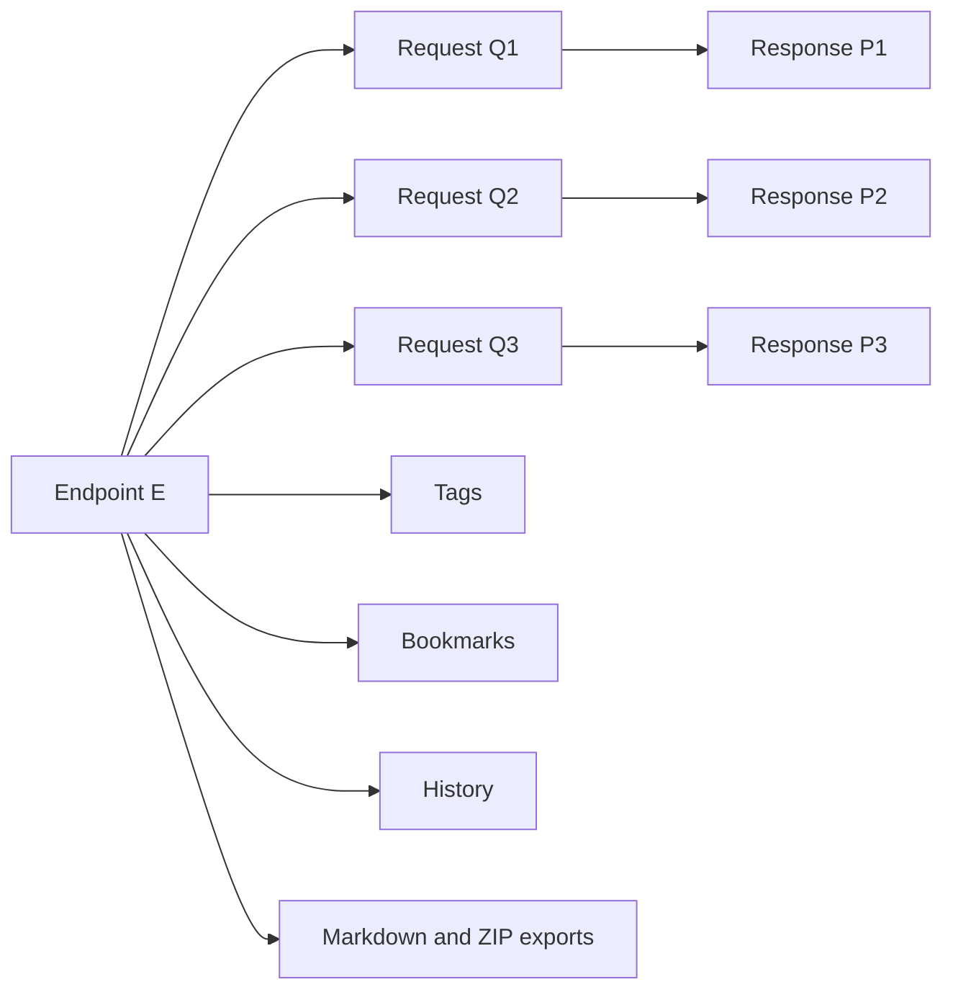

# What Is EDMS?

## Purpose

EDMS stands for Endpoint Data Management System. It is built for teams that need endpoint behavior, request payloads, response payloads, annotations, tags, bookmarks, history, and exportable documentation to stay understandable while services evolve.

The README describes the core problem as `EQP Chaos`: an endpoint can look stable while the valid request/response pairs around it keep changing.

## Problem: EQP Chaos

During development, teams often change request keys, payload values, response shapes, and expected status behavior faster than they update shared documentation. This causes coordination problems:

| Problem                                                                | Result                                             |
| ---------------------------------------------------------------------- | -------------------------------------------------- |
| Endpoint data is scattered across local tools, chat, and ad hoc files. | Developers cannot tell which payloads are current. |
| Request/response variants are not stored beside endpoint metadata.     | Breaking changes are harder to detect and review.  |
| Useful endpoint sets are not easy to share.                            | Teams repeat manual setup across environments.     |
| Documentation is not generated from actual endpoint data.              | Docs drift from implementation.                    |

EDMS turns endpoint IO knowledge into structured local metadata and file artifacts.

## Conceptual Model

| Symbol | Meaning          | Repository Mapping                                                        |
| ------ | ---------------- | ------------------------------------------------------------------------- |
| `E`    | Endpoint         | `endpoints` table, `EndpointDto`, list/test UI endpoint rows.             |
| `Q`    | Request payload  | `request_metadata`, request artifact files, JSON editor request state.    |
| `P`    | Response payload | `response_metadata`, response artifact files, JSON editor response state. |

The endpoint is the stable anchor. Requests, responses, tags, annotations, bookmarks, and history accumulate around that anchor.

## What EDMS Manages

| Capability             | Current Repository Support                                                                            |
| ---------------------- | ----------------------------------------------------------------------------------------------------- |
| Endpoint inventory     | SQLite schema, query map, webserver helpers, shared ops, list UI design.                              |
| Request metadata       | Webserver test flow inserts metadata before compute work is queued.                                   |
| Response metadata      | Schema and helper exist; callback insertion is not wired yet.                                         |
| Request/response files | Shared library JSON helpers and compute endpoint writer exist, but naming conventions need alignment. |
| Tags                   | Schema, queries, and shared `TagOps` support tag storage/search.                                      |
| Bookmarks              | Active bookmarks, named collections, backup folder marker, and collection load/create flows.          |
| History                | Save, list, count, and clear helpers plus update events.                                              |
| Documentation          | Compute markdown table generation and metadata list generation.                                       |
| Exports                | ZIP collection, bookmark ZIP, static export, ZIP/folder merge, and SQLite merge helpers.              |
| UI                     | React local-data app and static backend HTML client.                                                  |

## Primary Workflows

### Catalog Endpoint Data

The backend schema stores stable endpoint identity, path/string, annotation, creation timestamp, and update timestamp. Query helpers and shared ops expose CRUD-like behavior.

### Preserve Request and Response Evidence

The intended model keeps searchable metadata in SQLite and full request/response bodies on disk. This keeps the database lightweight while preserving artifacts that can be versioned or exported.

### Organize Useful Endpoint Sets

Bookmarks use a `folder` column:

| Folder Value         | Meaning                                       |
| -------------------- | --------------------------------------------- |
| `__active__`         | Current working bookmark set.                 |
| `__session_backup__` | Backup of the active set before replacing it. |
| Any other name       | A named collection.                           |

### Generate Shareable Artifacts

Compute functions generate:

| Artifact                 | Functionality                                         |
| ------------------------ | ----------------------------------------------------- |
| Endpoint markdown tables | Split endpoint reports into `endpoints-NNN.md` files. |
| Endpoint metadata list   | Write `endpoint-data.md`.                             |
| Collection ZIPs          | Package a folder as a ZIP archive.                    |
| Bookmark ZIPs            | Package files matching selected endpoint IDs.         |
| Static website exports   | Copy or ZIP static folders.                           |
| Merged archives          | Merge ZIP/folder inputs and merge SQLite files.       |

## Current Product Status

EDMS has a working backend skeleton for metadata, events, bookmarks, collection export, compute offload, folder management, and artifact generation. The React UI is a polished shell but still uses local/generated data. The static HTML client is closer to the live backend API because it opens WebSocket connections directly.

See [Home](Home#current-implementation-constraints) for current implementation constraints and setup notes.
